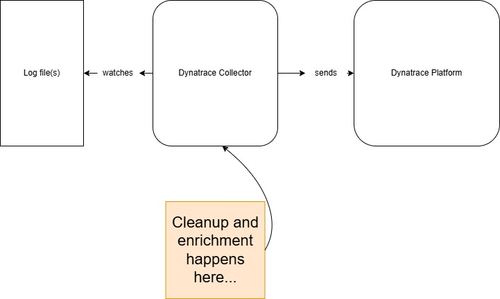

# Dynatrace Observability Lab: Syslog Ingest

--8<-- "snippets/disclaimer.md"
--8<-- "snippets/view-code.md"
--8<-- "snippets/bizevent-homepage.js"
--8<-- "snippets/openpipeline.md"

There is a **lot** of telemetry data. Reducing, removing and standardising the telemetry data that you ingest will save cost, increase signal to noise ratio and help make your Observability platform a cleaner, more useful place.

This hands on Observability Lab will demonstrate various tips and tricks on how to achieve a clean, standardised telemetry ingest using when you send data via the [Dynatrace Collector](https://docs.dynatrace.com/docs/ingest-from/opentelemetry/collector){target=_blank}.

The Dynatrace collector is a fully supported distribution of the open source upstream [OpenTelemetry collector](https://opentelemetry.io/docs/collector/){target=_blank}. The Dynatrace collector contains no vendor specific components.

## Compatibility

| Deployment         | Tutorial Compatible |
|--------------------|---------------------|
| Dynatrace Managed  | ✔️                 |
| Dynatrace SaaS     | ✔️                 |

- [Click here to begin :octicons-arrow-right-24:](getting-started.md)

