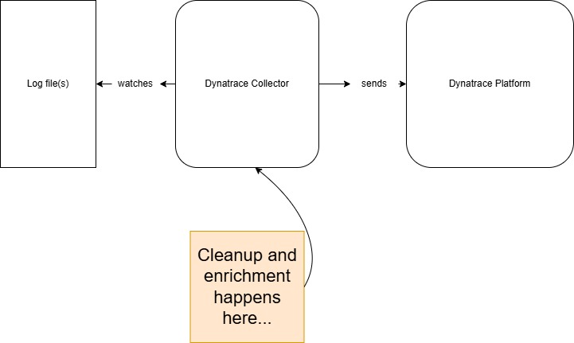

# Dynatrace Observability Lab: OpenTelemetry Patterns

--8<-- "snippets/disclaimer.md"
--8<-- "snippets/view-code.md"
--8<-- "snippets/bizevent-homepage.js"
--8<-- "snippets/openpipeline.md"

There is a **lot** of telemetry data. Reducing, removing and standardising the telemetry data that you ingest will save cost, increase signal to noise ratio and help make your Observability platform a cleaner, more useful place.

This hands on Observability Lab will demonstrate various tips and tricks on how to achieve a clean, standardised telemetry ingest using when you send data via the [Dynatrace Collector](https://docs.dynatrace.com/docs/ingest-from/opentelemetry/collector){target=_blank}:

1. [Logs: Batching](scenario1.md)
1. [Logs: Including file and Operating System information](scenario2.md)
1. [Logs: Correcting timestamps](scenario3.md)
1. [Logs: Setting default severity / status](scenario4.md)
1. [Logs: Setting severity / status based on log line content](scenario5.md)
1. [Logs: Adding Key/Value attributes based on log line content](scenario6.md)
1. [Logs: Dynamic rewriting of log content for standardisation](scenario7.md)
1. [Logs: Dropping logs based on log content](scenario8.md)
1. [Logs: Dropping low value logs](scenario9.md)
1. [Logs: Enriching logs with team / ownership metadata](scenario10.md)
1. [Logs: Extracting Metrics from Logs (using Dynatrace Query Language)](scenario11.md)
1. [Logs: Extracting Metrics from Logs (using a collector)](scenario12.md)
1. [Logs: Parsing CSV Files](scenario13.md)
1. [Logs: Redacting Logs](scenario14.md)
1. [Logs: Processing JSONL](scenario15.md)

The Dynatrace collector is a fully supported distribution of the open source upstream [OpenTelemetry collector](https://opentelemetry.io/docs/collector/){target=_blank}. The Dynatrace collector contains no vendor specific components.

- [Click here to begin :octicons-arrow-right-24:](getting-started.md)

