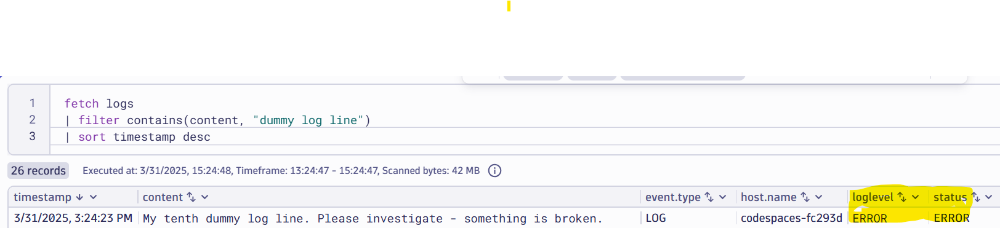

# Enrich with Ownership

--8<-- "snippets/bizevent-scenario10.js"

Adding ownership information to logs is critical to enable downstream usecases and further automation. If you know where a log comes from and who "owns" it (in other words, who can help action or fix the issue) that becomes very powerful for cross-charging Observability data ingest, automation, triggering workflows and AI agents.

In the prior scenarios, logs were being enriched line by line. Often though, you'll know that one team / department is responsbile for an entire log file (or set of log files). In this case, it makes sense to enrich at the log file level. The configuration is simpler and easier to read.

Imagine that the `file.log` file (and every log line that comes from it:

* Is owned by `TeamA`
* Has an email address of `team@example.com` for support / issues
* `teamA` has an team code of `ABC556D` (useful for cross-charging and ticket routing)

[scenario10.yaml](https://github.com/Dynatrace/demo-opentelemetry-cleanup/blob/main/scenario10.yaml){target=_blank} shows the OpenTelemetry collector configuration to achieve this.

## Stop Previous Collector

If you haven't done so already, stop the previous collector process by pressing `Ctrl + C`.

## Start Collector

Run the following command to start the collector:

``` { "name": "[background] run otel collector scenario 10" }
/workspaces/$RepositoryName/dynatrace-otel-collector --config=/workspaces/$RepositoryName/scenario10.yaml
```

!!! tip "Ordering matters"
    Notice the `service.pipelines.logs.processors` definition.
    
    Unlike [scenario 8](scenario8.md), the logs are `transform`ed first then filtered.
    
    This is to ensure the logs have the correct severity level before a filtering decision is made.

    ```
    processors: [resourcedetection, transform, filter, batch]
    ```

## Generate Log Data

Open `file.log` file and add these two lines then save the file.

```
My ninth dummy log line.
My tenth dummy log line. Please investigate - something is broken
```

!!! tip "Only 1 log line received"
    You should see only one of these lines in the collector & Dynatrace.

    Both log lines have no explicit severity, but remember the collector rules create severities due to the transform processor.

    * The first line: `My ninth dummy log line.` will be mapped to an `INFO` event.
    * The second line: `My tenth dummy log line. Please investigate - something is broken` will be mapped to an `ERROR` event.

    Due to the filter processor rules, the `INFO` line will be dropped and ONLY the `ERROR` log line will be sent to Dynatrace.

## View Data in Dynatrace

--8<-- "snippets/enlarge-image-tip.md"




```
fetch logs
| filter contains(content, "dummy log line")
```

Click the `Run` button again on the DQL tile. You should see the new data.

Congratulations! You can now surgically decide on which log lines to store.

<div class="grid cards" markdown>
- [Click here to continue :octicons-arrow-right-24:](scenario10.md)
</div>
