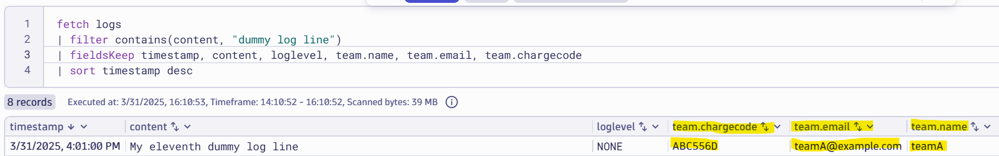

# Enrich with Ownership

--8<-- "snippets/bizevent-scenario10.js"

Adding ownership information to logs is critical to enable downstream usecases and further automation. If you know where a log comes from and who "owns" it (in other words, who can help action or fix the issue) that becomes very powerful for cross-charging Observability data ingest, automation, triggering workflows and AI agents.

In the prior scenarios, logs were being enriched line by line. Often though, you'll know that one team / department is responsbile for an entire log file (or set of log files). In this case, it makes sense to enrich at the log file level. The configuration is simpler and easier to read.

Imagine that the `file.log` file (and every log line that comes from it:

* Is owned by `TeamA`
* Has an email address of `team@example.com` for support / issues
* `teamA` has an team code of `ABC556D` (useful for cross-charging and ticket routing)

[scenario10.yaml](https://github.com/Dynatrace/demo-opentelemetry-cleanup/blob/main/scenario10.yaml){target=_blank} shows the OpenTelemetry collector configuration to achieve this.

## Stop Previous Collector

If you haven't done so already, stop the previous collector process by pressing `Ctrl + C`.

## Start Collector

Run the following command to start the collector:

``` { "name": "[background] run otel collector scenario 10" }
/workspaces/$RepositoryName/dynatrace-otel-collector --config=/workspaces/$RepositoryName/scenario10.yaml
```

## Generate Log Data

Open `file.log` file and add these two lines then save the file.

```
My eleventh dummy log line
```

## View Data in Dynatrace

--8<-- "snippets/enlarge-image-tip.md"




```
fetch logs
| filter contains(content, "dummy log line")
| fieldsKeep timestamp, content, loglevel, team.name, team.email, team.chargecode 
| sort timestamp desc
```

Click the `Run` button again on the DQL tile. You should see the new data.

Congratulations! Every log line from `file.log` will be automatically enriched with the team details.

<div class="grid cards" markdown>
- [Click here to continue :octicons-arrow-right-24:](scenario10.md)
</div>
