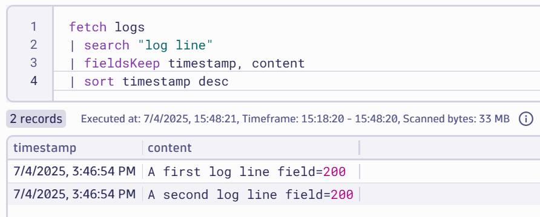
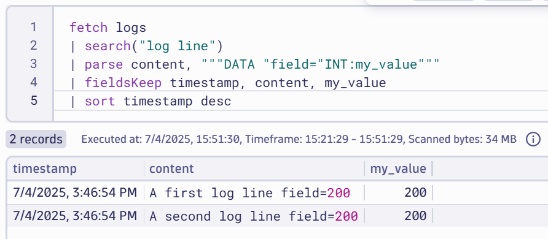
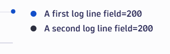
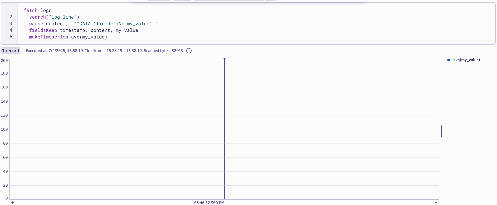
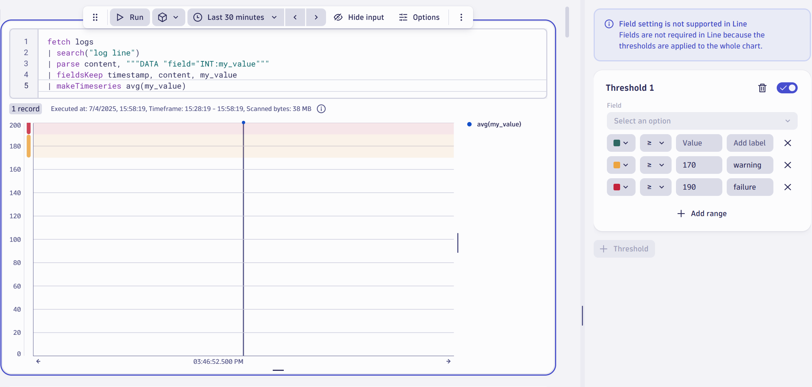
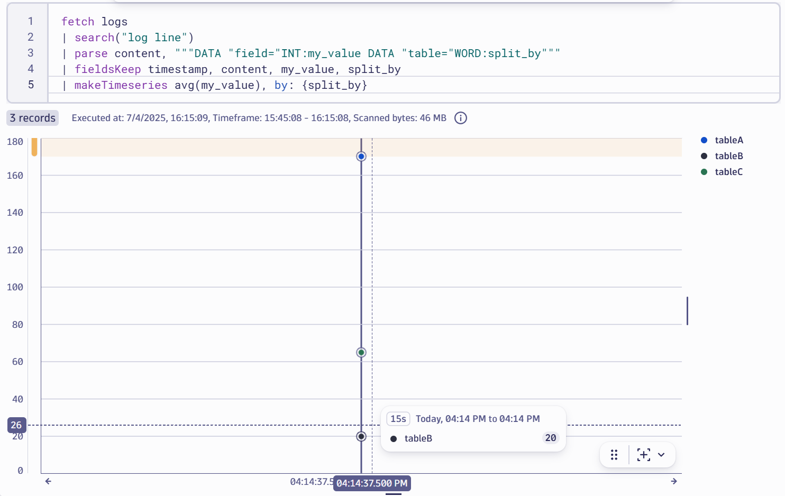

# Transform Logs to Metrics

--8<-- "snippets/bizevent-scenario11.js"

Often there are numerical values in log lines that you'd like to extract and chart as a timeseries.

## Simple Parsing
Take this log line for example: `A log line field=200`

You'd like to extract `200` and use that value.

[scenario11.yaml](https://github.com/Dynatrace/demo-opentelemetry-patterns/blob/main/scenario11.yaml){target=_blank} shows the base OpenTelemetry collector configuration we'll use during this exercise. Notice that beyond some host / operating system enrichment and batching, the telemetry is not altered in any way before it hits Dynatrace.

### Stop Previous Collector

If you haven't done so already, stop the previous collector process by pressing `Ctrl + C`.

### Start Collector

Run the following command to start the collector:

``` { "name": "[background] run otel collector scenario 11" }
/workspaces/$RepositoryName/dynatrace-otel-collector --config=/workspaces/$RepositoryName/scenario11.yaml
```

### Generate Log Data

Open `file.log` file and add these log lines then save the file.

```
A first log line field=200
A second log line field=200
```

### View Data in Dynatrace

--8<-- "snippets/enlarge-image-tip.md"



Open a new notebook (or add a DQL section to an existing notebook).

```
fetch logs
| search("log line")
| fieldsKeep timestamp, content
| sort timestamp desc
```

Click the `Run` button on the DQL tile. You should see the new data.

### Extract the Metric

Adjust your DQL to the following:

```
fetch logs
| search("log line")
| parse content, """DATA "field="INT:my_value"""
| fieldsKeep timestamp, content, my_value
| sort timestamp desc
```

Click the `Run` button again on the DQL tile. You should see a new column called `my_value` with the value of `200` extracted into its own field.



#### DQL Explained

Let's take a minute to understand the above DQL:

First, all logs are fetched. Next, the `content` field is parsed. The syntax says:

1. Expect some data, any data
1. Eventually you should find a literal string `field=`
1. Immediately after the `=`, expect an integer. Extract it as a standalone field and name the field `my_value`.

Then, of all the data you have, keep only the `timestamp`, `content` and `my_value` fields.

Finally, sort the log lines in descending timestamp order (most recent at the top).

### Charting Metrics as Timeseries

To chart the above, click the DQL panel, go to `Options` and change the visualization to `Line`.



There's a problem though, by default Dynatrace splits the timeseries based on the log line.

Using Dynatrace Query Language, you can tell Dynatrace to treat all `my_value` results as coming from a single source (ie. do not split by the textual value of the line) and thus you get one line on the chart.

To do so, use this DQL:

```
fetch logs
| search("log line")
| parse content, """DATA "field="INT:my_value"""
| fieldsKeep timestamp, content, my_value
| makeTimeseries avg(my_value)
```

As you have probably guessed, this time we're taking average `myValue` and creating a timeseries entity from it. This time, there is a single timeseries (line) which is what you want.



### Adding Thresholds

Under the options for the `Line` chart, find the `Thresholds` submenu and open it.

Here you can set **visual** thresholds.

Set a warning threshold for any value above `170` and a failure threshold for anything over `190`.



Hover over the bars on the left axis to see the labels: `warning` and `failure`.

## Multiple Series Log Parsing

Now imagine a more complex log example:

```
A log line field=170 table=tableA
A log line field=20 table=tableB
A log line field=65 table=tableC
```

We still want to extract the `field` value (`170`, `20` and `65`) but this time, these values refer to different "things". Meaning the value of `170` applies to `tableA`, the value of `20` applies to `tableB` and the value of `65` applies to `tableC`.

Obviously, if we somehow mixed this up and applied `170` to `tableC`, our charting and alerts would be incorrect.

So, how can we use DQL to achieve this?

First,  add these log lines to `file.log` and save the file:

```
A log line field=170 table=tableA
A log line field=20 table=tableB
A log line field=65 table=tableC
```

Next update the DQL as follows:

```
fetch logs
| search("log line")
| parse content, """DATA "field="INT:my_value DATA "table="WORD:split_by"""
| fieldsKeep timestamp, content, my_value
| makeTimeseries avg(my_value), by: {split_by}
```



Dynatrace has extracted the values and grouped by the `split_by` field. In other words, grouped by the table name.

<div class="grid cards" markdown>
- [Click here to continue :octicons-arrow-right-24:](whats-next.md)
</div>
