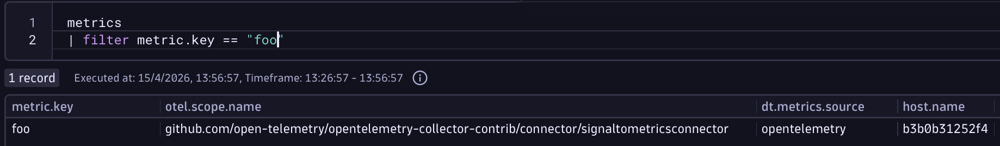
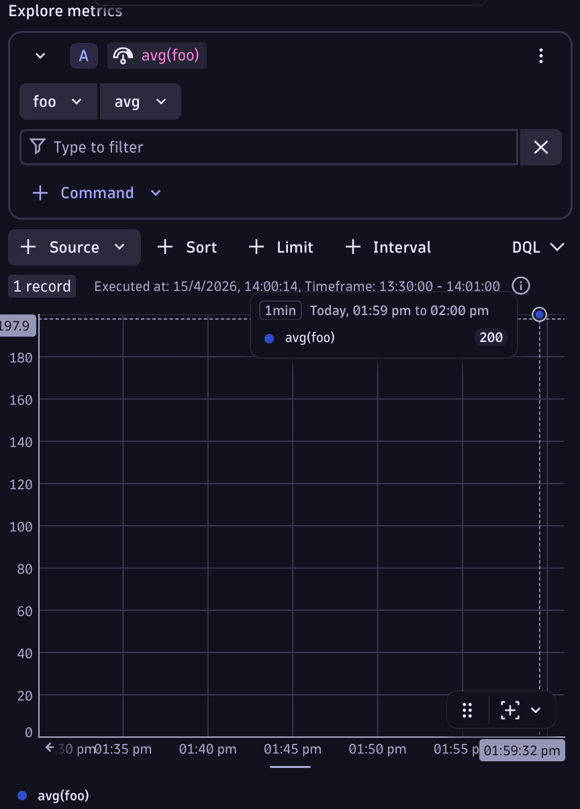

# Transform Logs to Metrics using the Collector

--8<-- "snippets/bizevent-scenario12.js"

!!! info ""

    This scenario uses a collector which contains the [signal_to_metrics](https://github.com/open-telemetry/opentelemetry-collector-contrib/tree/main/connector/signaltometricsconnector){target=_blank} connector [which the Dynatrace distribution doesn't currently include.](https://github.com/Dynatrace/dynatrace-otel-collector/blob/main/manifest.yaml#L55){target=_blank}


Often there are numerical values in log lines that you'd like to extract and chart as a timeseries.

## Simple Parsing
Take this log line for example: `A dummy log line field=200`

You'd like to extract `200` and use that value.

[scenario12.yaml](https://github.com/Dynatrace/demo-opentelemetry-patterns/blob/main/scenario12.yaml){target=_blank} shows the base OpenTelemetry collector configuration we'll use during this exercise.

The metric value is first extracted from the log lien using the `transform` processor and stored as a log attribute called `metrics` which is a Map of metric values.

The log line is passed to the `signal_to_metrics` connector (a connector connects two pipelines). The `signal_to_metrics` connector extracts the metric, calls it `foo` and parses it from a `String` to a `Double` (ie. an actual number).

The metric is then sent to a dedicated metrics pipeline and sent to Dynatrace.

### Stop Previous Collector

If you haven't done so already, stop the previous collector process by pressing `Ctrl + C`.

### Start Collector

Run the following command to start the collector:

``` { "name": "[background] run otel collector scenario 12" }
source .env
$BASE_DIR/otelcol-contrib --config=$BASE_DIR/scenario12.yaml
```

### Generate Log Data

Open `file.log` file and add these log lines then save the file.

```
A first dummy log line field=200
A second dummy log line field=200
```

### View Data in Dynatrace

--8<-- "snippets/enlarge-image-tip.md"




First check the metric exists using the `metrics` command.

```
metrics
| filter metric.key == "foo"
```

Then chart it either using DQL or the metrics chart. Here is the DQL:

```
timeseries avg(foo)
```

<div class="grid cards" markdown>
- [Click here to continue :octicons-arrow-right-24:](scenario13.md)
</div>
