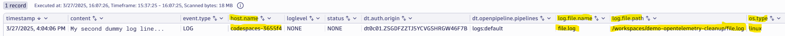

# Add File and OS Information

--8<-- "snippets/bizevent-scenario2.js"

It is usually important to know *where* the log lines are coming from. This helps fault domain isolation and enables quickly routing the problem to the relevant owner / team.

In this scenario, the collector will be used to enrich the log lines to include the following information on each log line:

* Hostname
* Operating system type
* Log file name
* Log file path

[scenario2.yaml](https://github.com/Dynatrace/demo-opentelemetry-cleanup/blob/main/scenario2.yaml){target=_blank} shows the OpenTelemetry collector configuration to achieve this.

## Stop Previous Collector

If you haven't done so already, stop the previous collector process by pressing `Ctrl + C`.

## Start Collector

Run the following command to start the collector:

``` { "name": "[background] run otel collector scenario 2" }
/workspaces/$RepositoryName/dynatrace-otel-collector --config=/workspaces/$RepositoryName/scenario2.yaml
```

## Generate Log Data

Open `file.log` file and add this line then save the file.

```
My second dummy log line...
```

## Verify Debug Data in Collector Output

View the collector terminal window and verify that the filelog receiver has sent the data to the collector. You should see terminal output like this:

```
...
2025-03-27T06:04:05.900Z        info    ResourceLog #0
Resource SchemaURL: https://opentelemetry.io/schemas/1.6.1
Resource attributes:
     -> host.name: Str(codespaces-3655f4)
     -> os.type: Str(linux)
...
Body: Str(My second dummy log line...)
Attributes:
     -> log.file.name: Str(file.log)
     -> log.file.path: Str(/workspaces/demo-opentelemetry-cleanup/file.log)
```

Notice that `host.name` and `os.type` have been added as resource attributes. The collector performed this lookup and attached them automatically.
Notice too that the log record has new attributes of `log.file.name` and `log.file.path`.

## View Data in Dynatrace

--8<-- "snippets/enlarge-image-tip.md"



Click the `Run` button again on the DQL tile you created in scenario 1. You should see the new data.

Reminder, the DQL statement is:

```
fetch logs
| filter contains(content, "dummy log line")
```

Congratulations! The log lines are now automatically enriched with important host-level information.

<div class="grid cards" markdown>
- [Click here to continue :octicons-arrow-right-24:](scenario3.md)
</div>
