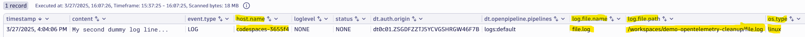

# Set Timestamps

--8<-- "snippets/bizevent-scenario3.js"

The log lines ingested from [scenario 1](scenario1.md) and [scenario 2](scenario2.md) contain no timestamps.

The collector and Dynatrace will make a best-effort guesses at the correct timestamp, but it is always best to set the timestamps explicitly.

To do this we will tell the collector to set two fields: `timestamp` and `observed timestamp` to the current timestamp (ie. `Now`).

[scenario3.yaml](https://github.com/Dynatrace/demo-opentelemetry-cleanup/blob/main/scenario3.yaml){target=_blank} shows the OpenTelemetry collector configuration to achieve this.

## Look Again

Look again at the collector debug output from scenario 2. You should see that the timestamp is actually set to 1970.

```
LogRecord #1
ObservedTimestamp: 2025-03-27 06:04:05.298857978 +0000 UTC
Timestamp: 1970-01-01 00:00:00 +0000 UTC
SeverityText: 
SeverityNumber: Unspecified(0)
Body: Str(My second dummy log line...)
Attributes:
     -> log.file.name: Str(file.log)
     -> log.file.path: Str(/workspaces/demo-opentelemetry-cleanup/file.log)
```

## Stop Previous Collector

If you haven't done so already, stop the previous collector process by pressing `Ctrl + C`.

## Start Collector

Run the following command to start the collector:

``` { "name": "[background] run otel collector scenario 3" }
/workspaces/$RepositoryName/dynatrace-otel-collector --config=/workspaces/$RepositoryName/scenario3.yaml
```

## Generate Log Data

Open `file.log` file and add this line then save the file.

```
My third dummy log line...
```

## Verify Debug Data in Collector Output

View the collector terminal window and verify that the `timestamp` and `observed timestamp` fields are now correctly set to the current time and date:

```
...
ObservedTimestamp: 2025-03-27 06:28:50.507084067 +0000 UTC
Timestamp: 2025-03-27 06:28:50.507083807 +0000 UTC
SeverityText: 
SeverityNumber: Unspecified(0)
Body: Str(My third dummy log line...)
...
```

## View Data in Dynatrace

--8<-- "snippets/enlarge-image-tip.md"



Click the `Run` button again on the DQL tile you created in scenario 1. You should see the new data.

Reminder, the DQL statement is:

```
fetch logs
| filter contains(content, "dummy log line")
```

Congratulations! The log lines now have the correct timestamps.

<div class="grid cards" markdown>
- [Click here to continue :octicons-arrow-right-24:](scenario4.md)
</div>
