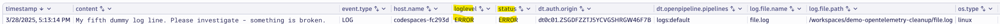

# Setting severity / status based on log content

--8<-- "snippets/bizevent-scenario4.js"

On occasion, you will need to adjust the severity of the log based on the actual log line content.

For example, a log line that reads: `Please investigate - something is broken` is mistakenly sent as an `INFO` level event when it really should be an `ERROR`.

[scenario5.yaml](https://github.com/Dynatrace/demo-opentelemetry-cleanup/blob/main/scenario5.yaml){target=_blank} shows the OpenTelemetry collector configuration to achieve this.

## Stop Previous Collector

If you haven't done so already, stop the previous collector process by pressing `Ctrl + C`.

## Start Collector

Run the following command to start the collector:

``` { "name": "[background] run otel collector scenario 5" }
/workspaces/$RepositoryName/dynatrace-otel-collector --config=/workspaces/$RepositoryName/scenario5.yaml
```

## Generate Log Data

Open `file.log` file and add this line then save the file.

```
My fifth dummy log line. Please investigate - something is broken.
```

## Verify Debug Data in Collector Output

View the collector terminal window and verify that the `timestamp` and `observed timestamp` fields are now correctly set to the current time and date:

```
...
SeverityText: INFO
SeverityNumber: Info(9)
Body: Str(My fourth dummy log line...)
...
```

## View Data in Dynatrace

--8<-- "snippets/enlarge-image-tip.md"



Click the `Run` button again on the DQL tile you created in scenario 1. You should see the new data.

Reminder, the DQL statement is:

```
fetch logs
| filter contains(content, "dummy log line")
```

Congratulations! The log lines now have the most appropriate log level.

<div class="grid cards" markdown>
- [Click here to continue :octicons-arrow-right-24:](scenario6.md)
</div>
