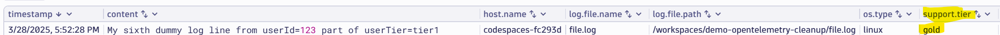

# Creating Attributes based on log content

--8<-- "snippets/bizevent-scenario6.js"

One of the benefits of an OpenTelemetry log is that it is structured. Rather than just a single log line with some text, the collector transforms it into a structured object (eg. JSON).

This makes it possible to attach new `attributes` to a log line. These attributes are key/value pairs of information that you care about.

In this scenario, you will add a new Key/Value attribute conditionally based on the content of the log line.

Imagine this log line:

```
My dummy log line from userId=123 part of userTier=tier1
```

That is somewhat useful, but it is probably more useful for a human if we instantly know that `tier1` customers qualify for the `gold` level support tier.

The OpenTelemetry collector can read the log line and add a new Key/Value pair:
```
support.tier: gold
```

when the log line contains `userTier=tier1`. `userTier2 == silver` and `userTier3 == bronze` and so on.

[scenario6.yaml](https://github.com/Dynatrace/demo-opentelemetry-cleanup/blob/main/scenario6.yaml){target=_blank} shows the OpenTelemetry collector configuration to achieve this.

## Stop Previous Collector

If you haven't done so already, stop the previous collector process by pressing `Ctrl + C`.

## Start Collector

Run the following command to start the collector:

``` { "name": "[background] run otel collector scenario 6" }
/workspaces/$RepositoryName/dynatrace-otel-collector --config=/workspaces/$RepositoryName/scenario6.yaml
```

## Generate Log Data

Open `file.log` file and add this line then save the file.

```
My sixth dummy log line from userId=123 part of userTier=tier1
```

## Verify Debug Data in Collector Output

View the collector terminal window and verify that the `support.tier` attribute has been added:

```
...
Body: Str(My sixth dummy log line from userId=123 part of userTier=tier1)
Attributes:
     -> log.file.name: Str(file.log)
     -> log.file.path: Str(/workspaces/demo-opentelemetry-cleanup/file.log)
     -> support.tier: Str(gold)
...
```

## View Data in Dynatrace

--8<-- "snippets/enlarge-image-tip.md"



There are a lot of columns shown so either scroll all the way to the right to see the `support.tier` column.

Or cleanup the columns by choosing to keep only certain columns:

```
fetch logs
| filter contains(content, "dummy log line")
| fieldsKeep timestamp, content, host.name, log.file.name, log.file.path, os.type, support.tier
```

Click the `Run` button again on the DQL tile. You should see the new data.

Congratulations! You can now add any important Key/Value information as logs flow through the collector.

<div class="grid cards" markdown>
- [Click here to continue :octicons-arrow-right-24:](scenario7.md)
</div>
