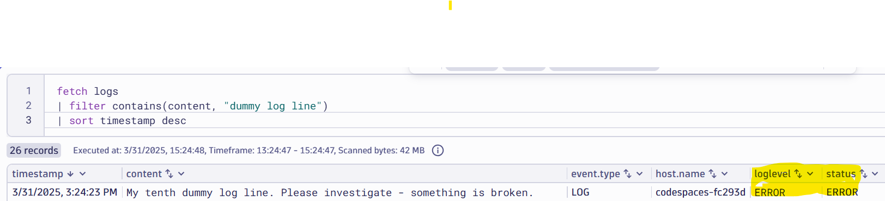

# Only Keep Important Logs

--8<-- "snippets/bizevent-scenario9.js"

Controlling Observability costs is important.

In this scenario, only logs with a severity level of `WARN` or above (eg. `Warning`, `Error` or `Fatal`)
Up to now, we have been processing and rewriting log content as it flows through the collector.

[scenario9.yaml](https://github.com/Dynatrace/demo-opentelemetry-cleanup/blob/main/scenario9.yaml){target=_blank} shows the OpenTelemetry collector configuration to achieve this.

## Stop Previous Collector

If you haven't done so already, stop the previous collector process by pressing `Ctrl + C`.

## Start Collector

Run the following command to start the collector:

``` { "name": "[background] run otel collector scenario 8" }
/workspaces/$RepositoryName/dynatrace-otel-collector --config=/workspaces/$RepositoryName/scenario9.yaml
```

!!! tip "Ordering matters"
    Notice the `service.pipelines.logs.processors` definition.
    
    Unlike [scenario 8](scenario8.md), the logs are `transform`ed first then filtered.
    
    This is to ensure the logs have the correct severity level before a filtering decision is made.

    ```
    processors: [resourcedetection, transform, filter, batch]
    ```

## Generate Log Data

Open `file.log` file and add these two lines then save the file.

```
My ninth dummy log line.
My tenth dummy log line. Please investigate - something is broken
```

!!! tip "Only 1 log line received"
    You should see only one of these lines in the collector & Dynatrace.

    Both log lines have no explicit severity, but remember the collector rules create severities due to the transform processor.

    * The first line: `My ninth dummy log line.` will be mapped to an `INFO` event.
    * The second line: `My tenth dummy log line. Please investigate - something is broken` will be mapped to an `ERROR` event.

    Due to the filter processor rules, the `INFO` line will be dropped and ONLY the `ERROR` log line will be sent to Dynatrace.

## View Data in Dynatrace

--8<-- "snippets/enlarge-image-tip.md"




```
fetch logs
| filter contains(content, "dummy log line")
```

Click the `Run` button again on the DQL tile. You should see the new data.

Congratulations! You can now surgically decide on which log lines to store.

<div class="grid cards" markdown>
- [Click here to continue :octicons-arrow-right-24:](scenario10.md)
</div>
