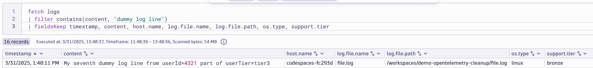

# Only Keep Important Logs

--8<-- "snippets/bizevent-scenario9.js"

Controlling Observability costs is important.

In this scenario, only logs with a severity level of `WARN` or above (eg. `Warning`, `Error` or `Fatal`)
Up to now, we have been processing and rewriting log content as it flows through the collector.

[scenario9.yaml](https://github.com/Dynatrace/demo-opentelemetry-cleanup/blob/main/scenario9.yaml){target=_blank} shows the OpenTelemetry collector configuration to achieve this.

## Stop Previous Collector

If you haven't done so already, stop the previous collector process by pressing `Ctrl + C`.

## Start Collector

Run the following command to start the collector:

``` { "name": "[background] run otel collector scenario 8" }
/workspaces/$RepositoryName/dynatrace-otel-collector --config=/workspaces/$RepositoryName/scenario9.yaml
```

!!! tip "Ordering matters"
    Notice the `service.pipelines.logs.processors` definition.
    
    `filter` is defined first so log lines are filtered first before further processing.

    ```
    processors: [filter, resourcedetection, transform, batch]
    ```

## Generate Log Data

Open `file.log` file and add this line then save the file.

```
My eighth dummy log line. The password is abc124
```

## Verify Debug Data in Collector Output

View the collector terminal window and verify that there is absolutely no record of the offending line in the collector logs:


* `user.tier` piece has been rewritten to `userTier`
* `support.tier` attribute has been added due to `userTier` being present in the log content


```
...
Body: Str(My seventh dummy log line from userId=4321 part of userTier=tier3)
Attributes:
     ...
     -> support.tier: Str(bronze)
...
```

## View Data in Dynatrace

--8<-- "snippets/enlarge-image-tip.md"



There are a lot of columns shown so either scroll all the way to the right to see the `support.tier` column.

Or cleanup the columns by choosing to keep only certain columns:

```
fetch logs
| filter contains(content, "dummy log line")
| fieldsKeep timestamp, content, host.name, log.file.name, log.file.path, os.type, support.tier
```

Click the `Run` button again on the DQL tile. You should see the new data.

Congratulations! You can now add any important Key/Value information as logs flow through the collector.

<div class="grid cards" markdown>
- [Click here to continue :octicons-arrow-right-24:](scenario10.md)
</div>
